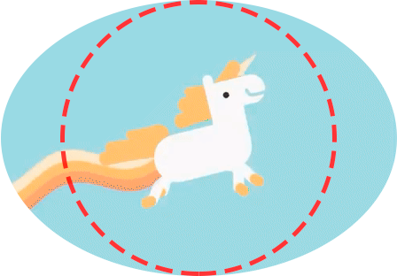

Últimamente están muy de moda los **avatares circulares**. En este artículo voy a hablar sobre algunas de las formas que existen en CSS de conseguir este efecto.

## La solución mala

Lo primero que se nos pasa por la cabeza cuando queremos avatares circulares es aplicar un `border-radius: 50%`. Puede parecer una buena solución, y desde luego es la más compacta, pero esto **nos obliga a que las imágenes sean cuadradas**, es decir, que tengan el mismo ancho que alto. Si somos nosotros los que gestionamos el diseño, podemos evitarlo haciendo todas las imágenes cuadradas de antemano. Pero, ¿y si permitimos que los usuarios suban sus propios avatares? Podríamos denegar las subidas de todos los avatares que no sean cuadrados, pero eso puede llegar a confundir al usuario. Tenemos que buscar otra solución.



## La solución fea

Una forma de resolver este problema sería con la propiedad `background-image` de CSS. Para ello crearíamos en nuestro HTML:

```html
<div class="avatar"></div>
```

Y darle los siguientes estilos:

```css
.avatar {
    border-radius: 50%;
    background-image: url('avatar.png');
    background-position: center;
    background-size: cover;
    height: 64px;
    width: 64px;
}
```

Aunque esta solución pueda parecer óptima, tiene un inconveniente importante: encerrar una imagen en un `div` no es semántico, y por tanto no es bueno para el SEO.

## Una buena solución

Gracias a los avances de CSS, hoy en día **tenemos las propiedades** `object-fit` y `object-position`, que cumplen la misma función que `background-size` y `background-position` pero **con el objeto en sí**. Esto nos permite usar en el **HTML** la etiqueta para imágenes, que es la más correcta semánticamente.

```html

```

Mientras que en el **CSS** es donde residirá la magia:

```css
.avatar {
    border-radius: 50%;
    height: 64px;
    object-fit: cover;
    object-position: center;
    width: 64px;
}
```

<iframe height="265" style="width: 100%;" scrolling="no" title="Circular avatar with CSS" src="https://codepen.io/sergios98/embed/QzrxOp?height=265&theme-id=dark&default-tab=result" frameborder="no" loading="lazy" allowtransparency="true" allowfullscreen="true">
  See the Pen <a href='https://codepen.io/sergios98/pen/QzrxOp'>Circular avatar with CSS</a> by Sergio Sanz
  (<a href='https://codepen.io/sergios98'>@sergios98</a>) on <a href='https://codepen.io'>CodePen</a>.
</iframe>

Si vemos el soporte de navegadores gracias a [Can I use](https://caniuse.com/#feat=object-fit), podemos comprobar que **Firefox, Chrome y Safari tienen soporte completo**. **Edge** también lo soporta si se aplica a imágenes (como es el caso), y si queremos soporte para **Opera Mini** deberemos añadir el prefijo `-o-`. Si queréis soportar **Internet Explorer** entonces no quedará más remedio que utilizar la solución fea.

En un futuro cercano, **los usuarios de Internet Explorer acabarán mudándose a un navegador moderno**, por lo que esta última solución se convertirá en la más conveniente para todos los casos.

Por supuesto **estas propiedades no se limitan a los avatares circulares**, y pueden ser usadas en infinidad de situaciones. Por ejemplo, en la entrada de mi blog, las imágenes de los posts tienen unas medidas concretas y para evitar que se deformen utilizo `object-fit`.
