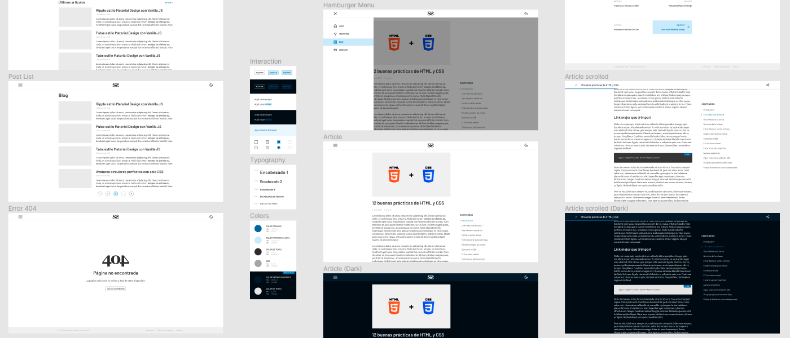

Coincidiendo con la vuelta de vacaciones, hoy estreno nueva web con un diseño completamente renovado. Acompañado de este lavado de cara estreno también nuevo dominio, convirtiéndose en [sergiosanz.dev](https://sergiosanz.dev/). Esta nueva dirección, a parte de ser más corta, representa mejor la temática del sitio (el desarrollo web).

## Nuevas tecnologías

Esta nueva web es mucho más que un rediseño, ya que supone un cambio completo en el _stack_ tecnológico del sitio. Mi objetivo con esta página es mantener un blog ligero donde pueda compartir algunos de los recursos que he ido desarrollando y me han sido útiles, así como alojar mi portafolio personal. 

Por ese motivo he decidido abandonar **Wordpress**, que es un CMS bastante pesado, para utilizar una tecnología orientada a construir **sitios estáticos**. En mi caso he elegido [Gatsby](https://www.gatsbyjs.com/), que se apoya en [React](https://reactjs.org/) y [GraphQL](https://graphql.org/).

**Gatsby** permite construir aplicaciones SPA (Single Page Application) que no recargan el documento entero cada vez que se cambia de página. Uno de los motivos por los que he elegido este sistema es su **increíble comunidad** que gracias a sus _plugins_ aceleran el tiempo de desarrollo.

## Un diseño más refinado

Como no podía ser de otra forma, la nueva web viene acompañada de **un diseño hecho completamente desde cero**, en el que no he utilizado ningún tipo de plantilla ni _starter_.

Este diseño se ha creado específicamente para **potenciar la experiencia de lectura**, eliminando todas las distracciones posibles.

Siguiendo con la tendencia de los últimos años, la web cuenta con un **modo oscuro** que mejora la lectura en entornos oscuros y se puede activar pulsando el botón ubicado en la parte superior derecha de la página. También he añadido un botón para compartir el artículo en redes sociales rápidamente y una lista con los contenidos del artículo que se está leyendo.

Otro detalle que he cuidado es la **accesibilidad**, mejorando el control desde el teclado y añadiendo las etiquetas necesarias para los lectores de pantalla. ¡Espero que disfrutes de una buena experiencia de lectura!

## Disponible en GitHub

Por último, he decidido compartir el código de la página en **GitHub** para que cualquiera pueda ver cómo ha sido construida e inspirarse para sus propias creaciones.

[Puedes acceder al repositorio haciendo clic en este enlace.](https://github.com/sergio-sanz/sergiosanz.dev/)
